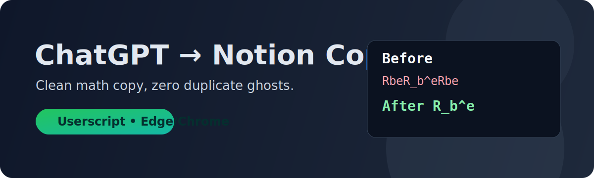
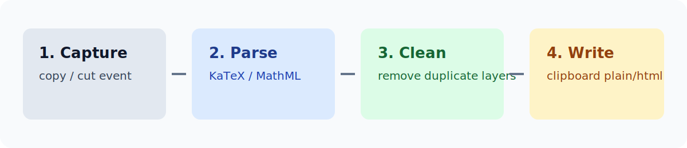

# ChatGPT to Notion Copy Fix ✨

  

  <b>复制 ChatGPT 到 Notion 时，自动清理公式重复文本（Rbe 分身）</b>

  
  
  
  

---

## 😫 痛点
从 ChatGPT 复制含数学公式内容到 Notion，常见变形：

- `R_b^e` 变成 `RbeR_b^eRbe`
- `(z_e)^b` 粘贴后混入 `(ze)b`

这通常是**可访问层文本 + 渲染层文本**被同时复制导致。

## 🚀 解决方案
这个用户脚本会在复制瞬间自动做四件事：

  

- 🎯 接管 `copy/cut` 事件
- 🧠 识别 KaTeX / MathJax / MathML 的 LaTeX 注释
- 🧹 清理隐藏层与重复来源节点
- 📋 重写剪贴板 `text/plain` + `text/html`

## ✅ 效果
- 不再出现 `RbeR_b^e` 这类“公式分身”
- 数学公式粘贴更稳定
- 普通正文复制行为保持自然

## ⚡ 快速安装（2 分钟）
1. 安装浏览器扩展：`Violentmonkey（暴力猴）`
2. 新建脚本，把下面文件内容粘贴进去并保存：
   - [`chatgpt-to-notion-copy-fix.user.js`](./chatgpt-to-notion-copy-fix.user.js)
3. 确认脚本为“已启用”
4. 强制刷新 ChatGPT 页面后测试复制

## 🧪 使用方法
1. 在 ChatGPT 里选中包含公式的文本并复制
2. 粘贴到 Notion
3. 检查公式是否仍出现重复文本

## 🌐 生效站点
- `https://chatgpt.com/*`
- `https://chat.openai.com/*`
- `https://*.openai.com/*`

## 🛠️ 故障排查
如果你发现“还是重复”：

1. 确认脚本在暴力猴中是启用状态
2. 确认当前页面 URL 命中 `@match`
3. 强制刷新页面后重试
4. 暂时禁用其他剪贴板增强扩展后再测

可附上以下信息提 Issue：
- ChatGPT 原文截图
- Notion 粘贴结果截图
- 最小复现文本

## 🗺️ Roadmap
- [ ] 可选“仅纯文本写入剪贴板”模式
- [ ] 调试模式（输出实际写入文本）
- [ ] 回归测试样例库（常见公式结构）

## 🤝 贡献
欢迎 Issue / PR，尤其欢迎：
- 新站点结构变更的兼容修复
- 公式节点提取策略优化
- 可复现异常样例补充

## 📄 License
MIT
